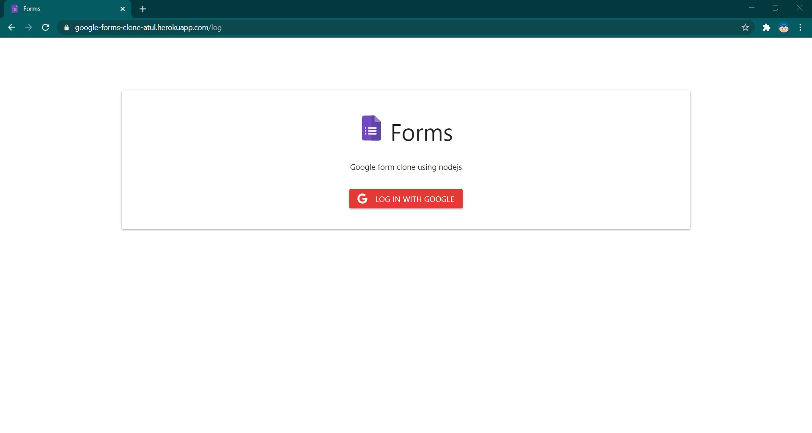
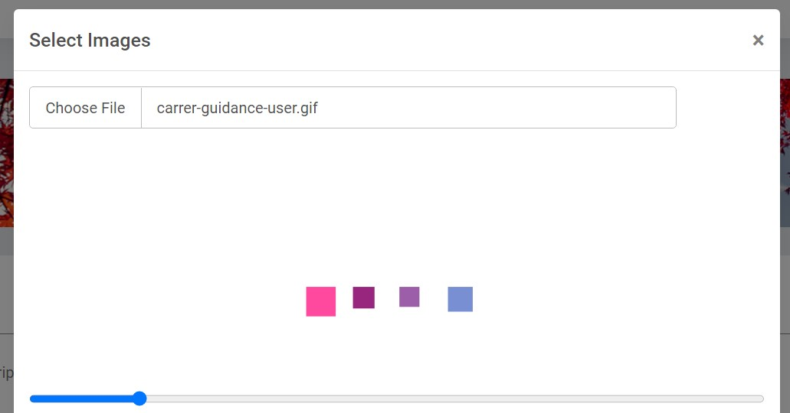
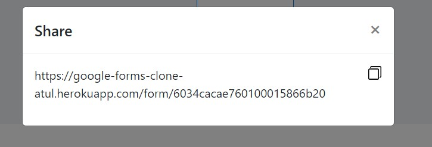
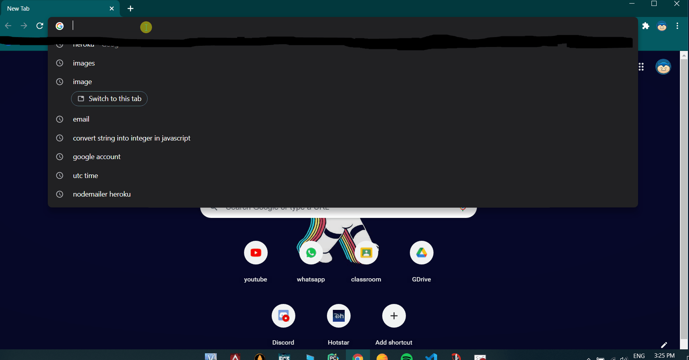
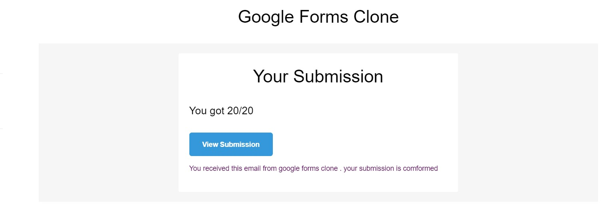
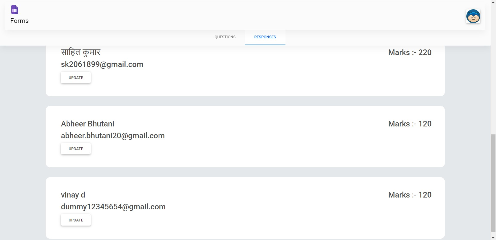
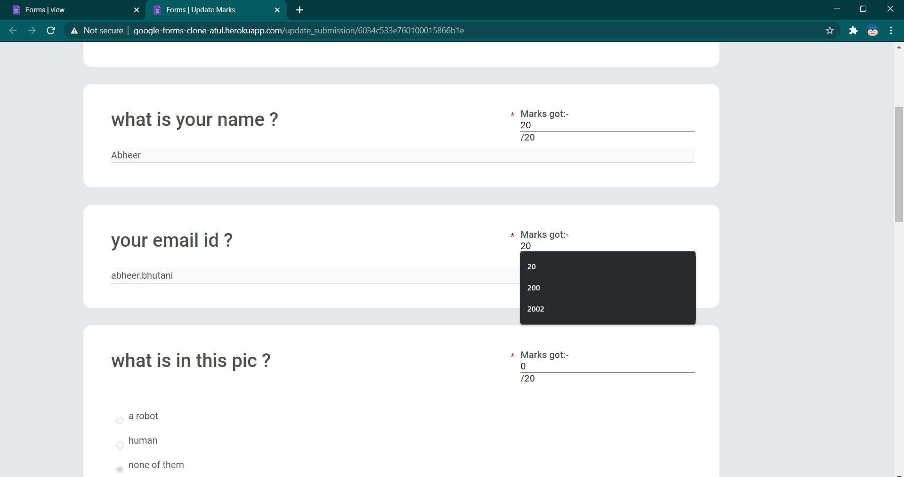

# google_forms_clone

A clone of Google forms using nodejs


# Getting Start

The backend of this application consists of a MongoDB database managed with REST API powered by Node and Express. The backend is hosted on and deployed to Heroku. The frontend is made in EJS .

# Dependencies 

```
Nodejs
express
EJS
express-session
method-override
mongoose
dotenv
connect-mongo
passport
passport-google-oauth20
path
mime-lib
multer
nodemailer
sharp
uuidv4
```
* The overall application is similar to google forms. There are following major functionalities of application:
   * A Form builder
   * Sharing, filling & submitting the form
   * Viewing the responses
   * marking the filled form 
   * Email after succesfull submission

# DEMO 
[Demo link herokuu](https://google-forms-clone-atul.herokuapp.com)

After cloning this repository ```https://github.com/atultyagi612/google_forms_clone.git```

Installing  all the dependances by ``` npm install ```

Run application by ``` npm start  ```

Then open your browser to localhost:3000.

# Screenshots

### **Login page**





### **Create Form**


### **Add Images to form**



### **Share Form**



### **User form submission**



### **Email after submission**



### **All the submissions**



### **Admin can update user submissions**



# License

Distributed under Apache 2.0 Licence . See [Licence](LICENSE) for more information.

# Contact

* Atul Tyagi - [atultyagi.at.612@gmail.com](atultyagi.at.612@gmail.com)
* Project link - [https://github.com/atultyagi612/google_forms_clone](https://github.com/atultyagi612/google_forms_clone)


